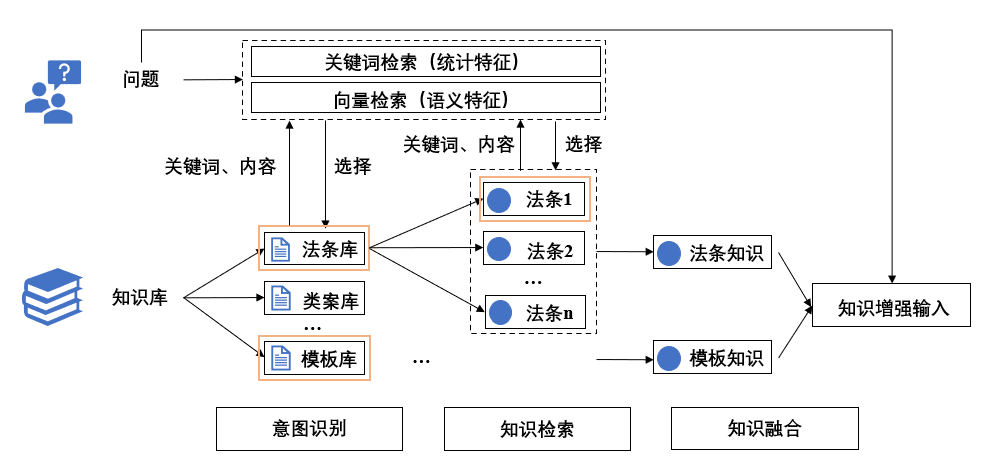
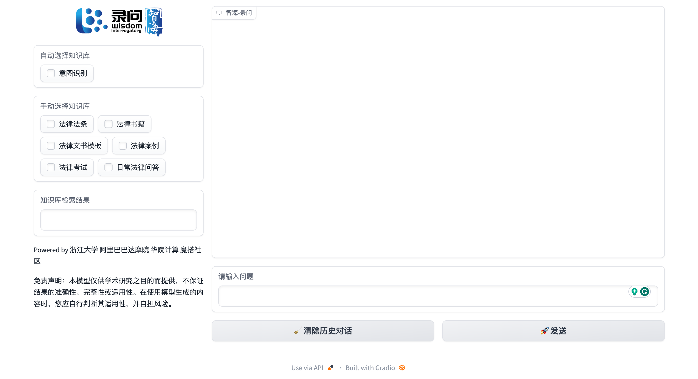
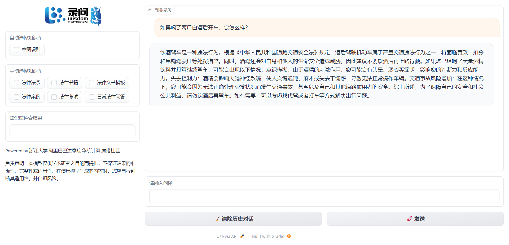
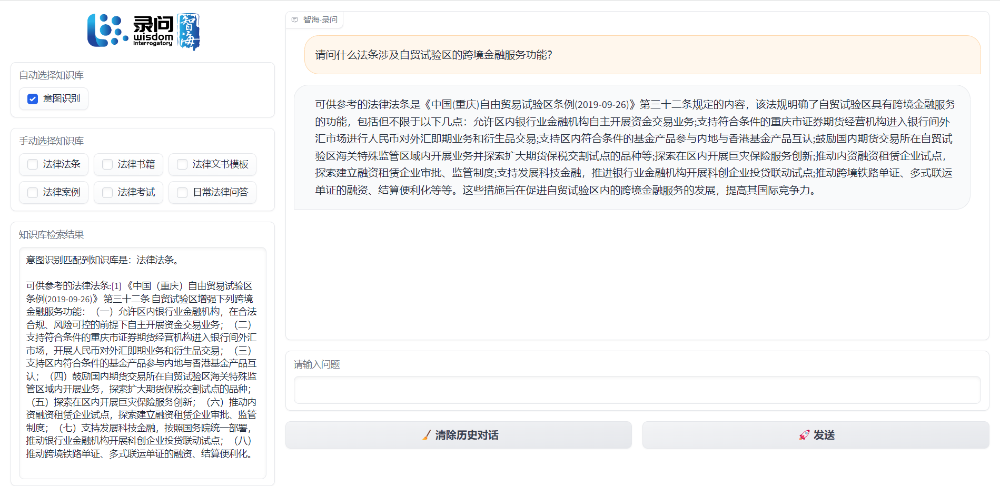
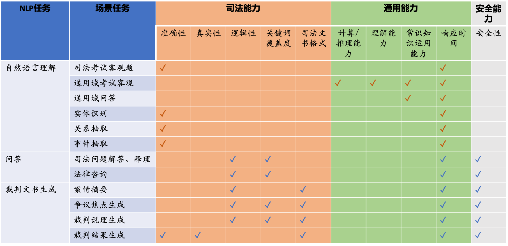

# 智海-录问


## 项目背景
智海-录问(wisdomInterrogatory)是由浙江大学、阿里巴巴达摩院以及华院计算三家单位共同设计研发的法律大模型。核心思想：以“普法共享和司法效能提升”为目标，从推动法律智能化体系入司法实践、数字化案例建设、虚拟法律咨询服务赋能等方面提供支持，形成数字化和智能化的司法基座能力。

下面主要介绍模型训练与模型增强。

## 模型训练

我们的模型基座是[Baichuan-7B](https://github.com/baichuan-inc/baichuan-7B)，在此基础上，进行了二次预训练以及指令微调训练。

### 二次预训练

二次预训练的目的是给通用的大模型注入法律领域的知识。预训练的数据包括法律文书、司法案例以及法律问答数据，共40G。

### 指令微调训练

经过了二次预训练之后，在指令微调阶段，我们使用了100k的指微调训练，其目的是让大模型具备问答的能力，能够直接与用户进行交流。


1.  **数据分布**

- 法律数据类别：
        
    本研究使用的数据类别包括法考题、司法咨询、法律情景问答、触犯法律与罪名预测、刑期预测、法院意见、案件摘要提取等。
        

- 法律数据来源：
        
    广泛收集了公开的法律数据集和相关的文本资料用于数据的构造。
    

- 法律数据分布：
        
| 类别 | 数据量 | 输入 | 输出 |
|-|-|-|-|
| 法律咨询 | 7k | 你好。我在网上贷上钱里别人让我带了两千多元,被人骗了这个钱不换可以吗? | 很抱歉听到您被骗了。如果您确定是被骗了,您可以向警方报案,并提供相关证据,以便警方调查和追回您的损失。此外,您也可以咨询律师,了解您的法律权利和应对措施。但是请注意,如果您在网上贷款中签署了相关合同,您可能需要承担相应的法律责任。 |
| 情景问答 | 3k | 如果一个拍卖企业的注册资本不足一千万元人民币,该企业能否经营文物拍卖? | 根据《拍卖法》第十三条规定,拍卖企业经营文物拍卖的注册资本应当达到一千万元人民币以上,因此如果一个拍卖企业的注册资本不足一千万元人民币,该企业不能经营文物拍卖。 |
| 罪名预测 | 0.5k | 安溪县人民检察院指控,被告人陈1某于2016年2月以来,通过微信向“督鸟”(另案处理)以4400元的价格购买他人银行卡5张及配套的他人身份证4张,2016年3月15日在安溪县湖头镇美溪村顺丰快递店领取包裹后被当场查获。经查证,其中3张银行卡系以虚假身份证明骗领的银行卡。被告人陈1某被查获时被扣押涉案的银行卡、身份证、银行U盾、手机卡、银行开户资料、快递单及手机。案件中被告人犯下了哪些罪名? | 根据所提供材料,被告人陈1某通过购买他人银行卡和身份证,并使用虚假身份证明骗领银行卡,其行为触犯了《中华人民共和国刑法》第一百七十七条之一的规定,可能构成妨害信用卡管理罪。 |
| 触犯法律预测 | 0.5k | 能否告诉我被告人在刑法中触犯了哪些法律条款?石家庄市鹿泉区人民检察院指控,2013年9月28曰晚上,被告人杨某与米某、吴某1(又名吴某2)在鹿泉区宜安镇北鲍庄村村口饭店因琐事发生争斗,杨某用刀将吴某1扎伤,经法医鉴定,吴某1的损伤为轻伤。 | 根据所提供材料,被告人杨某因琐事与米某、吴某1在鹿泉区宜安镇北鲍庄村村口饭店发生争斗,杨某用刀将吴某1扎伤,致其轻伤。其行为触犯了《中华人民共和国刑法》第二百三十四条,故意伤害他人身体的,处三年以下有期徒刑、拘役或者管制。 |
| 刑期预测 | 0.5k | 案例中被告人可能面临什么刑罚?经审理查明,2013年初,何某某在沈阳市大东区望花中街89号宝地铭郡项目承包了部分工程后,雇佣伊某某、刘某某等人进行工程施工。何某某在收到工程款未向伊某某、刘某某等人全额支付人工费,尚欠28.6万元未支付。沈阳市大东区农民工维权中心责令何某某向伊某某等人支付上述款项。2014年6月,何某某向伊某某等人支付人民币10万元,剩余18.6万元在责令支付期满后仍未支付。被告人何某某于2014年10月3日被公安机关传唤到案后支付了上述款项。上述事实,被告人何某某在开庭审理过程中亦无异议,且有被害人刘某某、伊某某的陈述;书证抓捕经过、人口基本信息、电话查询记录、××涉嫌犯罪案件移送书、责令书、工资发放表、欠条、工资表等证据证实,足以认定。 | 1. 根据所提供材料,被告人何某某拒不支付伊某某、刘某某等人的劳动报酬,欠款金额达到18.6万元。\n2. 《中华人民共和国刑法》第二百七十六条之一规定,以转移财产、逃匿等方法逃避支付劳动者的劳动报酬或者有能力支付而不支付劳动者的劳动报酬,数额较大,经政府有关部门责令支付仍不支付的,处三年以下有期徒刑或者拘役,并处或者单处罚金;造成严重后果的,处三年以上七年以下有期徒刑,并处罚金。\n3. 本案中,被告人何某某的犯罪性质为拒不支付劳动报酬罪,犯罪情节为以转移财产等方法逃避支付劳动者的劳动报酬,欠款金额较大,且经政府有关部门责令支付后仍不支付。该行为严重侵害了劳动者的合法权益,造成了一定的经济损失。\n4. 综上所述,根据《中华人民共和国刑法》相关规定,预测被告人何某某可能被判处拘役六个月,并处罚金30000元。 |
| 法考选择题 | 1.2k | 甲公司将共享单车投放在街边。不考虑数额,下列行为构成盗窃罪的是?A.乙将共享单车的锁拆掉,放在自家楼下,专供自己免费使用的\nB.乙正常使用完共享单车后,将车停在自家楼下,方便自己下次扫码使用的\nC.乙将市区的共享单车偷偷搬到偏远农村,供村民扫码使用的\nD.乙将市区的共享单车偷偷搬到偏远农村,供村民免费使用的\n解答该题 | 解析过程如下:\n1. 乙通过平和的手段,将权利人占有的财物转移为自己占有,使权利人遭受财产损失,成立盗窃罪。A选项构成盗窃罪。\n2. 乙并没有破坏权利人的占有,权利人也没有财产损失,B选项不构成盗窃罪。\n3. 乙并没有破坏权利人的占有,权利人也没有财产损失,C选项不构成盗窃罪。\n4. 非法占有目的可以是为自己,也可以是为第三人,乙将共享单车搬到农村给村民免费使用的行为使权利人遭受财产损失,成立盗窃罪,D选项构成盗窃罪。综上,本题正确答案为AD选项。 |
| 案件摘要提取 | 3k | 息县人民检察院指控:2014年2月24日15时30分许,被告人李某某在没有建筑资质的情况下,承建息县白土店乡卫生院东“教育小区”住宅楼时,违反安全管理的规定,未设置任何安全防护措施,致使建筑工人赵某某在拆模时从工地三楼飘窗坠落后被掉落的横梁砸击腹部致死。2014年2月27日,双方达成民事赔偿协议,被告人李某某一次性赔偿被害人赵某某近亲属各项损失共计400000元。被害人亲属自愿申请撤诉,不再要求追究被告人李某某的刑事和民事责任。\n材料中涉及的客观行为、主观动机和事外情节是什么? | 根据提供材料可知:\n1. 客观行为:被害人赵某某在拆模过程中,从工地三楼飘窗坠落后被掉落的横梁砸击腹部致死\n2. 主观动机:被告人李某某在没有建筑资质及安全防护措施的情况下建设住宅楼 \n3. 事外情节:双方达成民事赔偿协议,被告人李某某一次性赔偿被害人赵某某近亲属各项损失,被害人亲属自愿申请撤诉,不再要求追究被告人李某某的刑事和民事责任。 |
| 司法判断题 | 2.3k | 2009年1月，甲(1993年4月生)因抢劫罪被判处有期徒刑1年。2011年3月20日，甲以特别残忍手段故意杀人后逃跑，6月被抓获。关于本案，下列选项是正确的? | 根据中国刑法，未满18周岁的人犯罪，可以适用少年刑事法律制度。而甲在抢劫罪时已经满18周岁，因此被判处有期徒刑1年，说明他已经适用成年刑事法律制度。因此，在2011年3月20日故意杀人后，甲已经是成年人，应该适用成年刑事法律制度。根据中国刑法，故意杀人罪可以适用死刑，因此甲可以被判处死刑。 |
| 法律多轮对话 | 0.8k | （其中一轮）这个案件中，被告人何某某的辩护律师是否可以使用被告人在案发后如实供述罪行的事实辩护？ | 根据材料，被告人何某某在案发后如实供述自己的罪行。辩护律师可以使用被告人在案发后如实供述罪行的事实进行辩护。根据《中华人民共和国刑事诉讼法》第六十七条，被告人如实供述自己的罪行，可以从轻或者减轻处罚。因此，辩护律师可以利用被告人如实供述罪行的事实来争取减轻被告人的刑罚。 |
| 法院意见 | 3k | 经审理查明，2011年11月24日，被告人袁太平到被害人李某的红木家具店，以需要红木沙发样板给老板看为由，在李某店内取走了一套红酸枝战国秦某八件套沙发，并约定2011年12月10日归还。袁太平骗取得李某该套沙发后，并没有拿给老板看样板，而是将该套沙发抵押给彭某，用于抵消他欠彭某的债务，随后，袁太平逃离凭祥，更换电话号码。2012年1月5日，凭祥市公安局从彭X处将该套红木沙发追回，并发还给被害人李某。经广西红木产品质量监督检验中心鉴定，被骗的八件套沙发材质为红酸枝木，属蝶形花科黄X。经凭祥市价格认证中心认定，被追回的红酸枝沙发价值人民币62000元。\n现在，请根据以上的案件信息写出本院认为。 | 本院认为，被告人袁太平以非法占有为目的，虚构事实骗取他人财物，数额巨大，其行为已触犯《中华人民共和国刑法》第二百六十六条的规定，构成诈骗罪。公诉机关指控被告人袁太平犯诈骗罪罪名成立。对被告人袁太平辩称其已告知李某借红木沙发是拿去抵债，其不构成诈骗罪的辩解，经查，被告人袁太平在其已欠下巨额外债无力偿还的情况下，虚构要借红木沙发做样板给老板看的事实，使被害人产生错误认识，将红木家具借给被告人，被告人拿到红木家具后却用于抵偿其欠彭某的借款，被告人主观上具有非法占有的故意，其行为符合诈骗罪的构成要件，故对被告人的辩解不予采纳。\n根据被告人袁太平的犯罪事实、性质、情节和对社会的危害程度及认罪态度，依照《中华人民共和国刑法》第二百六十六条、第五十二条、第五十三条，《最高人民法院关于适用财产刑若干问题的规定》第二条第一款的规定，判处被告人有期徒刑三年六个月。 |
| 法律阅读理解 | 1k | 挪用公款罪在刑法中的具体条文规定是什么？\n可供参考的法条内容: \"第三百八十四条 【挪用公款罪】国家工作人员利用职务上的便利，挪用公款归个人使用，进行非法活动的，或者挪用公款数额较大、进行营利活动的，或者挪用公款数额较大、超过三个月未还的，是挪用公款罪，处五年以下有期徒刑或者拘役;情节严重的，处五年以上有期徒刑。挪用公款数额巨大不退还的，处十年以上有期徒刑或者无期徒刑。\n挪用用于救灾、抢险、防汛、优抚、扶贫、移民、救济款物归个人使用的，从重处罚。 | 《中华人民共和国刑法》第三百八十四条 【挪用公款罪】国家工作人员利用职务上的便利，挪用公款归个人使用，进行非法活动的，或者挪用公款数额较大、进行营利活动的，或者挪用公款数额较大、超过三个月未还的，是挪用公款罪，处五年以下有期徒刑或者拘役;情节严重的，处五年以上有期徒刑。挪用公款数额巨大不退还的，处十年以上有期徒刑或者无期徒刑。\n挪用用于救灾、抢险、防汛、优抚、扶贫、移民、救济款物归个人使用的，从重处罚。 |
| 其他 | 0.5k | 我是仲裁申请人中国龙傲天能源有限公司，法定代表人为龙傲天。2018年7月7日我们根据《中德双边投资协定》在德国慕尼黑市投资建立了一个全资钢铁厂，进行跨国业务。但是在经营期间，我们发现被申请人德国政府对于我们这种外资企业的征税额是10%，远远高于其对于本国企业所规定的6%。我们认为德国政府这一行为违反了国际投资法领域以及双边投资协定中的国民待遇原则。我们决定申请仲裁，仲裁请求是（1）请求德国政府支付赔偿金 （2）给予我们外资企业和他们本国企业一样的税收政策。请帮我生成一份仲裁申请书，内容包括申请人信息、仲裁依据、仲裁请求、事实和理由等。 | 仲裁申请书尊敬的仲裁庭： \n我方为中国龙傲天能源有限公司，法定代表人为龙傲天。我们根据《中德双边投资协定》在德国慕尼黑市投资建立了一个全资钢铁厂，进行跨国业务。然而在经营期间，我们发现被申请人德国政府对于我们这样的外资企业的征税额高于其对于本国企业的规定。我们认为这一行为违反了国际投资法领域以及双边投资协定中的“国民待遇”原则。 \n具体来说，我们发现被申请人德国政府在对外资企业征税时征收10%的税额，远远高于其对于本国企业征收的6%税额。我们认为这种做法违反了投资协定中规定的“国民待遇”原则，被申请人德国政府不应当以这种方式对待我们外资企业和他们本国企业不同的税收政策。 \n在此，我方向仲裁庭提出以下仲裁请求：\n1. 请求德国政府向我方支付赔偿金，以此弥补我们在经营过程中所遭受的经济损失。\n2. 请求德国政府给予我们外资企业和他们本国企业一样的税收政策，并且确保未来德国政府对于外资企业和本国企业之间不存在任何税收优惠或者差异。 \n因此，我方在此提出仲裁申请。并请仲裁庭依据相关法律及国际法理作出公正的仲裁裁决。\n中国龙傲天能源有限公司\n法定代表人：龙傲天\n2021年5月15日 |

- 数据总体占比：
        
    法律领域数据占总体数据的30%，通用数据占总体数据的70%。通用数据中，英文数据和中文数据各占50%。
        

- 通用数据：
        
    + 英文数据：[LIMA](https://huggingface.co/datasets/GAIR/lima) 、[OpenOrca](https://huggingface.co/datasets/Open-Orca/OpenOrca) 、[ShareGPT](https://huggingface.co/datasets/RyokoAI/ShareGPT52K)等
            
    + 中文数据：[BELLE](https://huggingface.co/datasets/BelleGroup/train_1M_CN) 、[MOSS](https://huggingface.co/datasets/YeungNLP/moss-003-sft-data)等
            
2.  **数据收集与筛选**
    
- 对数据进行去重和清洗，通过条件过滤去除低质量的数据和重复数据。
        
- 对数据进行聚类和下采样。先使用[Sentence-BERT](https://arxiv.org/abs/1908.10084)对数据进行句子嵌入，然后对嵌入向量进行正则化和降维。之后利用KMeans算法对数据进行聚类，并在聚类簇中使用KCenter算法进行降采样。
        

3.  **数据改造**
    
- 触犯法律与罪名预测
        
    + 原始数据：案件事实以及被告人触犯的法律与罪名。
            
    + 改造数据：使用ChatGPT生成多样化指令并与案件事实随机拼接作为输入。基于已知答案，通过GPT-3.5生成包含事件摘要和触犯法律(和罪名)的输出。
           
 
- 刑期预测
        
    + 原始数据：案件事实以及被告人被判刑罚。
            
    + 改造数据：使用ChatGPT生成多样化指令并与案件事实随机拼接作为输入。基于已知答案，通过GPT-3.5生成包含事件摘要、触犯法律、犯罪性质分析和刑期预测的输出。
            

- 法考题、法院意见、案件摘要提取
        
    + 原始数据：法考题、法院意见、案件事实及其摘要。
            
    + 改造数据：使用ChatGPT生成多样化指令并与原始数据随机拼接作为输入。对原始数据进行简单处理生成输出。
            

- 法律多轮对话数据生成
        
    使用不同prompt分别设置GPT-3.5为法律助手模型和用户模型，进行多轮对话。第一轮由用户模型基于法律事件随机提出问题，之后每轮利用prompt引导用户模型从不同角度提问或基于上轮对话进行深入提问，法律助手模型则负责对用户问题进行回复。


## 模型增强

### 知识库构建

我们目前一共收集了6种类型的知识库，包括法条类、案例类、模板类、书籍类、法律考试类、法律日常问答类。
1. **知识库收集与处理**
- 法条库
    + 法条库中包含了宪法、法律（宪法相关法、民商法、刑法、经济法、行政法、社会法、诉讼与非诉讼程序法）、司法解释、地方性法规（浙江、河南、北京、广东、重庆、山东、上海）、监察法规和行政法规。
    + 处理：输出为多个txt文件，其中刑法是json文件，key是标题，value是内容。
- 法律文书模版库
    + 法律文书模版库包含了民法、刑法和行政法三大部门法的起诉状、上诉状、法院判决书模版，以及合同等常用法律文书模版。
    + 处理：由于模版通常较长，因此通过ChatGPT总结得到文书模版的书写要点。最后得到一个json文件，key是文书标题，value是文书标题和要点。
- 法学书籍库
    + 法学书籍库涵盖了民法, 国际私法, 环境资源法, 法理学, 国际经济法, 中国特色社会主义法治理论, 民事诉讼法, 刑法, 刑事诉讼法, 司法制度和法律职业道德, 商法, 劳动与社会保障法, 宪法, 行政法与行政诉讼法, 国际法, 知识产权法, 经济法, 中国法律史等领域。
    + 处理：根据标题处理为多个txt文件以及与其对应的json文件，key是标题，value是内容。    
- 案例库
    + 案例库包含了刑法、民法领域中的大量案例。
    + 处理：由于案件事实通常较长，因此通过ChatGPT将案件事实总结成【主观动机】、【客观行为】以及【事外情节】三个部分。最后得到一个json文件，key是案件事实，value是事实和判决结果。
- 法考题库
    + 法考题库包含了2016年到2020年的1200题考题、选项、解析和答案。
    + 处理：一个json文件，key是问题，value是问题、选项、解析和答案。
- 法律日常问答库
    + 法律问答库包含了几千条法律领域的常见问题和答案数据。
    + 处理：一个json文件，key是问题，value是答案。
   
2. **知识库存储**

- 任何一个知识点都是一个[key, value]的pair，其中key是该知识点的内容简介，用于检索，而value是知识点的具体内容，用于输入到模型中作为参考。

### 知识增强

1. **知识定位**
- 意图识别（多步检索）

不同问题需要不同类型的知识库来辅助问答，首先需要识别出问题意图获取哪些知识。我们通过问题中的关键词和上述五种类型知识库的特征的关键词匹配，以此识别出问题涉及的知识类型并用对应知识库辅助。通过识别问题意图，缩小需要检索的知识库范围，减少易混淆知识带来的影响，提升检索精确度。

- 知识检索（多路检索）

检索的时候，同时采用统计特征层面的检索和语义特征层面的检索。（1）对于统计特征，我们预先提取知识库中每条知识的关键词，比如法条库中每条法条的关键词是所属法律和法条条数，我们使用fuzzy matching提取问题中的关键词和知识关键词匹配获取相关知识；（2）对于语义特征，我们使用向量相似度检索，为了提升检索精确度，我们预先准备每条知识对应的摘要，向量检索时使用知识摘要和问题进行相似度计算，找到相关知识后替换成具体知识。

- 检索模型训练

为了获得更好的检索效果，我们额外利用对比学习训练了检索模型的embedding，具体地，我们将案例所对应的真实法条、类似案例、相关书籍描述等知识作为正例，并通过随机抽取和易混淆抽取（抽取和案例相似度高但并不对应的知识）两种方式获取负例。

2. **知识融合**

知识检索在意图识别阶段可能涉及多个知识库类型，我们将检索到的不同来源的知识融合后输入给法律大模型。比如询问一个案例如何判罚时，意图识别阶段识别出应在法条库和类案库做检索，我们把和知识库名和其下检索到的知识拼接，再和问题拼接，共同输入到模型生成答案：
- 可参考的知识：法条：知识1，知识2 类案：知识1，知识2 问题：XXX，请问这个案例应该如何判罚？

<!-- ## 模型评测
由于大模型是生成模型，比较难通过脚本定量评测，为了初步评估目前录问的能力，我们在四个任务上进行了人工评测，包括：
1. 案件要素抽取

2. 法律文本摘要

3. 法律法规问答

4. 司法决策推理 -->

## 使用说明
1. **训练**

#### 训练环境安装
```shell
transformers>=4.27.1
datasets==2.13.0
evaluate==0.4.0
accelerate>=0.20.1
deepspeed==0.9.5
sentencepiece==0.1.99
deepspeed>=0.8.3
pytest-rerunfailures>=11.1.2
tensorboard==2.13.0
```

#### 配置DeepSpeed

本示范代码采用 DeepSpeed 框架进行训练。用户需根据集群情况，修改 `ds_config/`内配置文件，如果是多机多卡，需要修改 ssh 中各个节点的 IP 配置。具体可以参见 DeepSpeed [官方说明](https://www.deepspeed.ai/) 。


#### 训练代码：全量参数微调

部分参数解释：

`model_name_or_path` : 源模型路径。如：`models/baichuan-7b`

`deepspeed` : deepspeed配置文件路径。如：
`ds_config/zero2-A100-40G.json`

`train_file` : SFT训练数据文件路径。如：
`data_demo/demo.jsonl`

`output_dir` : 模型保存路径。如：
`output/baichuan_7b_test`


```shell
export NPROC_PER_NODE=6 # Num of GPU
export MASTER_ADDR=127.0.0.1
export MASTER_PORT=9527
export WORLD_SIZE=1
export RANK=0

DISTRIBUTED_ARGS="--nproc_per_node ${NPROC_PER_NODE} \
                  --nnodes ${WORLD_SIZE} \
                  --node_rank ${RANK} \
                  --master_addr ${MASTER_ADDR} \
                  --master_port ${MASTER_PORT}"

NCCL_DEBUG=INFO torchrun $DISTRIBUTED_ARGS run_clm.py \
  --model_name_or_path models/baichuan-7b \ # path to source model
  --deepspeed ds_config/zero2-A100-40G.json \  # path to deepspeed config file
  --train_file "data_demo/demo.jsonl" \ # path to sft data file
  --output_dir output/baichuan_7b_test \ # path to saved model 
  --bf16 \ 
  --gradient_checkpointing 1 \
  --per_device_train_batch_size 1 \
  --per_device_eval_batch_size 1 \
  --gradient_accumulation_steps 5 \
  --num_train_epochs 3 \
  --learning_rate 1e-5 \
  --logging_steps 10 \
  --save_strategy "epoch" \
  --warmup_ratio 0.1 \
  --weight_decay 0.1 \
  --do_train \
  --do_eval \
  --overwrite_output_dir \
  --max_seq_length 4096 \
  --dataloader_num_workers 24 \
  --preprocessing_num_workers 10
```

#### Tensorboard

<html>
    <table style="margin-left: auto; margin-right: auto;">
        <tr>
            <td>
    
            </td>
            <td>
    
            </td>
        </tr>
    </table>
</html>

```shell
tensorboard --logdir=luwen_baichuan/output/baichuan_7b_test/runs
```


2. **推理**

#### 推理环境安装
```shell
transformers>=4.27.1
accelerate>=0.20.1
torch>=2.0.1
sentencepiece==0.1.99
```

#### 推理代码调用
```python
from transformers import AutoModelForCausalLM, AutoTokenizer
import os
import torch
os.environ["CUDA_VISIBLE_DEVICES"] = "0"

model_path = "path_to_model"

def generate_response(prompt):
    torch.cuda.empty_cache()
    inputs = tokenizer(f'</s>Human:{prompt} </s>Assistant: ', return_tensors='pt')
    inputs = inputs.to('cuda')
    with torch.no_grad():
        pred = model.generate(**inputs, max_new_tokens=800, repetition_penalty=1.2)
    response = tokenizer.decode(pred.cpu()[0], skip_special_tokens=True)
    return response.split("Assistant: ")[1]

tokenizer = AutoTokenizer.from_pretrained(model_path, trust_remote_code=True)
model = AutoModelForCausalLM.from_pretrained(model_path, device_map="auto", trust_remote_code=True).half()
prompt = "如果喝了两斤白酒后开车，会有什么后果？"
resp = generate_response(prompt)
print(resp)
```


3. **界面**

功能介绍：
- 在“请输入问题”框中输入问题，并点击发送，模型就会做出对应的回答，如果继续输入，那么就会执行多轮对话，如果希望重新开始一次对话，那么就点击“清除历史对话”。
- 在模型问答的基础上，可以通过检索相关知识以作为输入的补充。勾选“意图匹配”，则会自动匹配到相关知识库，可同时“手动选择知识库”，与自动识别的知识库做合并后检索。
- “知识库检索结果”中会显示检索到的最相关的知识。

## 模型参数下载

模型参数在以下百度网盘中：（我们会尽快上传）

将压缩包解压后，放于luwen_baichuan/output/目录下，即可使用，注意文件夹名字要与infer代码中的model_path一致。

知识库数据在以下百度网盘中：
链接:https://pan.baidu.com/s/16lwM2rPnSq9u-UbtWbZgig  密码:anuo

将压缩包解压后，放于app目录下，即可使用。


## 模型效果
以下是模型推理、意图识别和知识检索的效果图：

1. **模型推理**




2. **意图识别**



3. **知识检索**


## 未来方向
1. **知识库检索**

目前通过纯embedding匹配的检索效果仍然一般，后面考虑设计一套流程，可以自动训练得到针对某一知识库的专用检索模型，
同时，模型对融合的知识的理解能力仍有限，考虑在模型训练中对结合知识输出这方面进行增强。

2. **评测矩阵**

为了更好的评估大模型的能力，我们设计了一个评测矩阵，从**司法能力**、**通用能力**以及**安全能力**三个角度展开评测，目前数据仍在收集构造中。


3. **多模态能力**

尽管大多数法律数据都以文本形式出现，但法律场景中，仍有许多其他形式的数据，如录音、图片、视频等，因此多模态的能力也很重要，下图是一个多模态应用场景的例子。


## 免责声明

本模型仅供学术研究之目的而提供，不保证结果的准确性、完整性或适用性。在使用模型生成的内容时，您应自行判断其适用性，并自担风险。

<!-- ## 参考文献

Wei, Bin, et al. "A full-process intelligent trial system for smart court." Frontiers of Information Technology & Electronic Engineering 23.2 (2022): 186-206. -->
